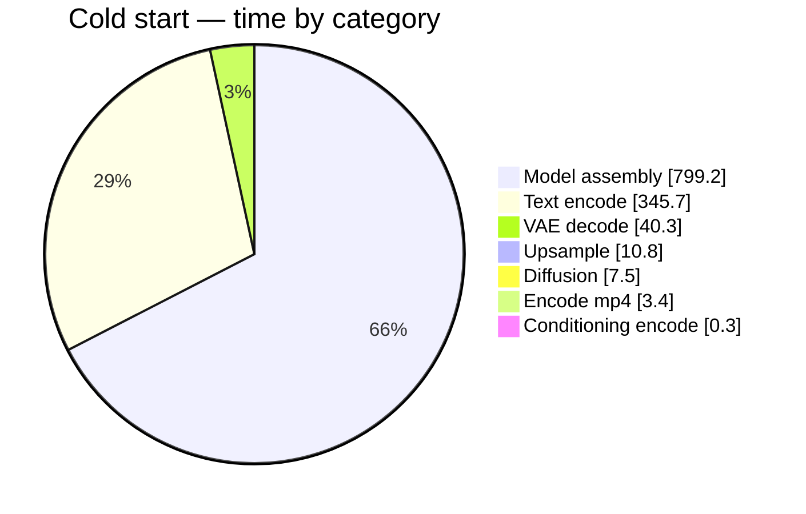
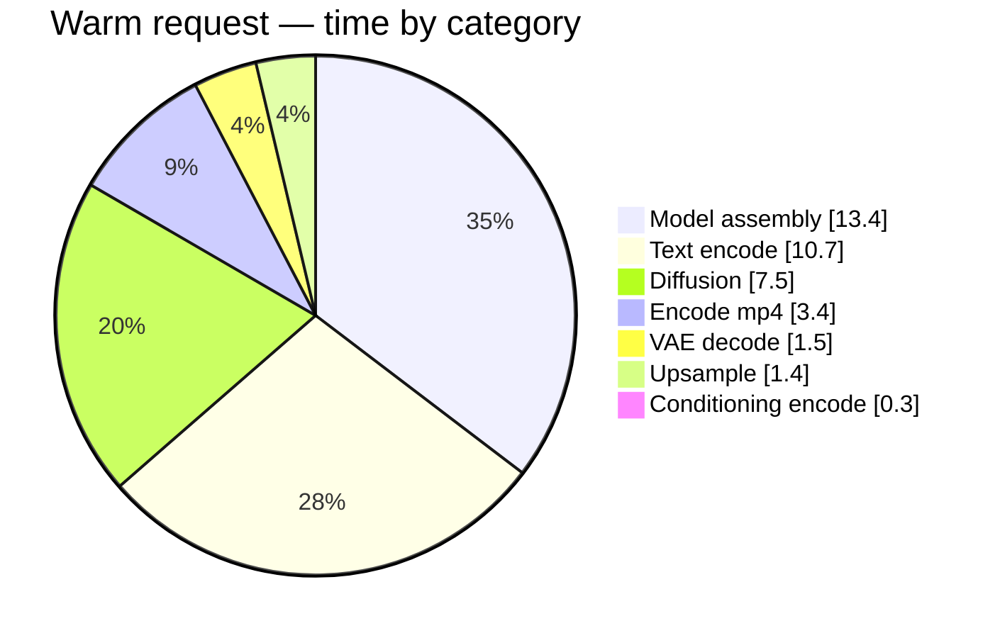

# Where the time goes — LTX-2 Motion-Transfer timing report

> Auto-generated by `gen_timing_doc.py` from real runs logged to `timings.jsonl`. Re-run it after any change to refresh the numbers.

**Measured config:** 121 frames, 768×768, fp8-cast, text-encoder on CPU, single GPU.

## TL;DR

- **Cold start (first request) ≈ 20.1 min.** It is almost entirely two one-time weight loads: `build_transformer_s1` (776s) and `prompt_encode` (346s). The GPU sits idle during this — it is disk/RAM-bound.
- **Warm request ≈ 38s.** The biggest slices are **Model assembly** (35%) and **Text encode** (28%) — i.e. re-assembling models onto the GPU and encoding the prompt, **not** diffusion.
- **Caching the source-video vectors saves only ~0.21s** (`encode_conditionings_s1`) on a warm request — it is *not* where the time goes. The real levers are keeping the assembled transformer resident on the GPU and caching the prompt embedding. See [Recommendations](#recommendations).

## Pipeline flow (with warm-run times)

```mermaid
flowchart TD
    A["Prompt text"] -->|prompt_encode<br/>10.7s| B["Stage 1 setup"]
    B -->|build_video_encoder 0.8s| C["VAE encoder ready"]
    C -->|encode_conditionings_s1 0.21s<br/>(video+image VAE)| D["Conditionings"]
    D -->|build_transformer_s1 10.2s| E["Transformer ready"]
    E -->|denoise_stage1 3.5s| F["Low-res latent"]
    F -->|upsample_to_stage2 1.4s| G["Upscaled latent"]
    G -->|build_transformer_s2 2.3s| H["Stage-2 transformer"]
    H -->|denoise_stage2 4.0s| I["Refined latent"]
    I -->|decode_video 0.8s + decode_audio 0.7s| J["Frames"]
    J -->|mp4_encode 3.4s| K["output .mp4"]
```

## Cold start — first request after server start

Total: **1207s (~20.1 min)**

### By category

| Category | Seconds | % | |
|---|---:|---:|---|
| Model assembly | 799.18s | 66.2% | `██████████████████████████··············` |
| Text encode | 345.74s | 28.6% | `███████████·····························` |
| VAE decode | 40.31s | 3.3% | `█·······································` |
| Upsample | 10.78s | 0.9% | `········································` |
| Diffusion | 7.53s | 0.6% | `········································` |
| Encode mp4 | 3.45s | 0.3% | `········································` |
| Conditioning encode | 0.34s | 0.0% | `········································` |



### By phase

| Phase | Seconds | % of total | |
|---|---:|---:|---|
| `build_transformer_s1` | 776.19s | 64.3% | `██████████████████████████··············` |
| `prompt_encode` | 345.74s | 28.6% | `███████████·····························` |
| `decode_video` | 31.28s | 2.6% | `█·······································` |
| `build_video_encoder` | 18.85s | 1.6% | `█·······································` |
| `upsample_to_stage2` | 10.78s | 0.9% | `········································` |
| `decode_audio` | 9.03s | 0.7% | `········································` |
| `build_transformer_s2` | 4.15s | 0.3% | `········································` |
| `denoise_stage2` | 4.01s | 0.3% | `········································` |
| `denoise_stage1` | 3.52s | 0.3% | `········································` |
| `mp4_encode` | 3.45s | 0.3% | `········································` |
| `encode_conditionings_s1` | 0.26s | 0.0% | `········································` |
| `encode_image_cond_s2` | 0.07s | 0.0% | `········································` |
| **TOTAL** | **1207.4s** | **100%** | |

## Warm request — every request after the model is loaded

Total: **38s**

### By category

| Category | Seconds | % | |
|---|---:|---:|---|
| Model assembly | 13.38s | 35.1% | `██████████████··························` |
| Text encode | 10.65s | 27.9% | `███████████·····························` |
| Diffusion | 7.51s | 19.7% | `████████································` |
| Encode mp4 | 3.43s | 9.0% | `████····································` |
| VAE decode | 1.48s | 3.9% | `██······································` |
| Upsample | 1.42s | 3.7% | `█·······································` |
| Conditioning encode | 0.28s | 0.7% | `········································` |



### By phase

| Phase | Seconds | % of total | |
|---|---:|---:|---|
| `prompt_encode` | 10.65s | 27.9% | `███████████·····························` |
| `build_transformer_s1` | 10.20s | 26.7% | `███████████·····························` |
| `denoise_stage2` | 4.01s | 10.5% | `████····································` |
| `denoise_stage1` | 3.50s | 9.2% | `████····································` |
| `mp4_encode` | 3.43s | 9.0% | `████····································` |
| `build_transformer_s2` | 2.34s | 6.1% | `██······································` |
| `upsample_to_stage2` | 1.42s | 3.7% | `█·······································` |
| `build_video_encoder` | 0.84s | 2.2% | `█·······································` |
| `decode_video` | 0.78s | 2.1% | `█·······································` |
| `decode_audio` | 0.70s | 1.8% | `█·······································` |
| `encode_conditionings_s1` | 0.21s | 0.6% | `········································` |
| `encode_image_cond_s2` | 0.07s | 0.2% | `········································` |
| **TOTAL** | **38.2s** | **100%** | |

## Recommendations

Ranked by payoff, based on the numbers above:

1. **Eliminate the cold start for users — pre-warm at startup.** Start the server with `WARMUP_ON_STARTUP=1` so the ~20-min weight load happens before anyone connects. Already supported in `server.py`. This is the single biggest UX win.

2. **Keep the assembled transformer resident on the GPU between requests.** On a warm request, `build_transformer_s1` (+`s2`) still costs ~12s because the model is re-assembled from the cached CPU state-dict and re-cast to fp8 on every call. Holding the built transformer on the GPU (instead of rebuilding) would remove most of this. Biggest *per-request* win.

3. **Cache the prompt embedding for the fixed prompt.** `prompt_encode` costs ~10s warm (Gemma runs on CPU and is loaded/torn down each call). When the prompt is unchanged, cache the embedding and skip it. Second-biggest per-request win.

4. **Do NOT bother caching the source-video latents for speed.** It targets `encode_conditionings_s1`, which is well under a second on a warm run. (It may still be worth it for *correctness/consistency*, but not for time.)

## How this was measured

- `ltx_pipelines/utils/timing.py` — thread-local `tick()` profiler (syncs CUDA so GPU work is attributed to the right phase).
- `ic_lora.py` `__call__` is annotated with one `T.tick(<phase>)` per stage boundary.
- `pipeline_runtime.generate()` brackets the call with `T.begin()/report()`, times the mp4 mux, and appends a JSON record to `timings.jsonl` tagged `cold`/`warm`.
- `cold` = weights not yet cached (first run / prewarm); `warm` = weights already in the shared `StateDictRegistry`.
- Regenerate this file with `python gen_timing_doc.py`.

## Phase glossary

| Phase | What it does | Category |
|---|---|---|
| `prompt_encode` | Encode the text prompt (Gemma text-encoder, runs on CPU) | Text encode |
| `build_video_encoder` | Assemble the VAE video *encoder* (weights -> GPU) | Model assembly |
| `encode_conditionings_s1` | VAE-encode the reference VIDEO + subject IMAGE (stage 1) | Conditioning encode |
| `build_transformer_s1` | Assemble the 22B transformer for stage 1 (weights -> GPU, fp8 cast) | Model assembly |
| `denoise_stage1` | Stage-1 diffusion (low-res denoising loop) | Diffusion |
| `upsample_to_stage2` | Spatially upsample the stage-1 latent for stage 2 | Upsample |
| `build_transformer_s2` | Assemble the transformer for stage 2 (weights -> GPU) | Model assembly |
| `encode_image_cond_s2` | VAE-encode the subject IMAGE again at full res (stage 2) | Conditioning encode |
| `denoise_stage2` | Stage-2 diffusion (high-res refinement loop) | Diffusion |
| `decode_video` | VAE-decode latents -> video frames (+build decoder cold) | VAE decode |
| `decode_audio` | VAE-decode audio + vocoder (+build cold) | VAE decode |
| `mp4_encode` | Mux/encode the frames into the output .mp4 | Encode mp4 |
